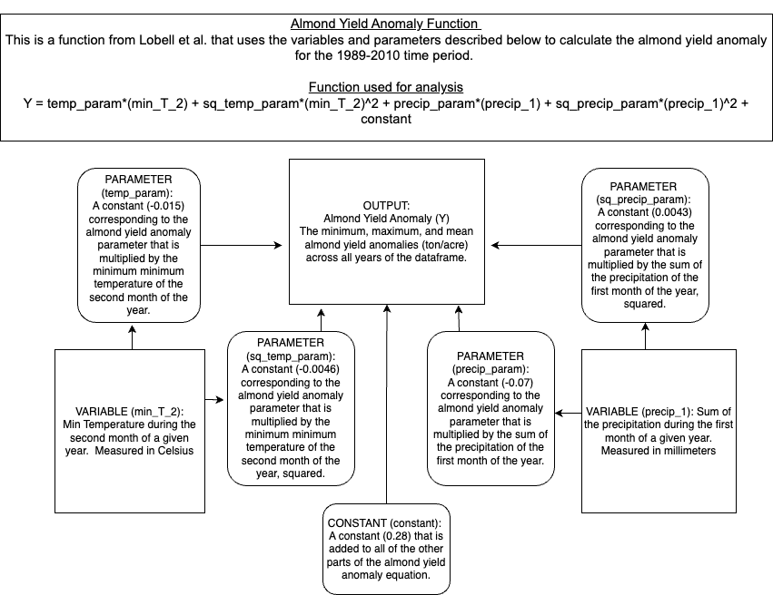

## Our model diagram image:


## Implementing our function:

```{r, message = FALSE}
# Read in almond yield anomaly function
source("calc_almond_yield_anomaly.R")
```

```{r}
# Test it on clim.txt (this is the default file name, so no need to pass anything to the function)
# This will grab max, min, mean almond yield anomalies for 1989-2010 (the time period of clim.txt)
calc_almond_yield_anomaly()

# We get the desired outputs for min, max, mean
```

